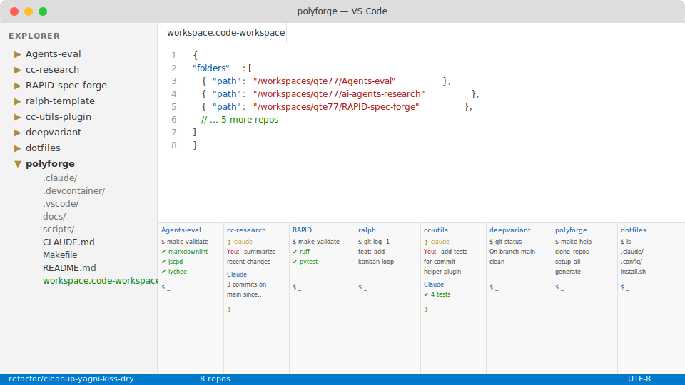

<!-- markdownlint-disable MD033 -->
# polyforge-orchestrator

Orchestrate parallel AI coding agents across
a polyrepo codebase from a single Codespace
or devcontainer.

**For** teams running Claude Code (or other AI agents)
across multiple repos simultaneously.
**Run** `./scripts/cc-parallel.sh --preset validate`
to validate all repos in one command.

## Quick Start

```bash
./scripts/cc-parallel.sh --preset validate
./scripts/cc-parallel.sh --preset security
./scripts/cc-status.sh
```

Repos: edit `config/repos.conf`. Credentials:
set `GH_PAT` as Codespace secret.

<details>
  <summary>Workspace preview — multi-repo IDE layout with parallel terminals</summary>
  
</details>

## How It Works

On codespace creation (`make setup_all`), polyforge installs
shared tooling (Claude Code, RTK, lychee, markdownlint),
clones all repos from `config/repos.conf`, and generates
`workspace.code-workspace` with terminal tasks per repo.

On attach (`make setup_repos`), it reads each repo's
`devcontainer.json` and runs their `onCreateCommand` +
`postCreateCommand` inside the host container — bridging
the gap where multi-root workspaces only run the host
container's devcontainer lifecycle.

Terminal tasks auto-open via `runOn: folderOpen` in both
VS Code Desktop and Web.

## Docs

- [Codespaces](docs/codespaces.md) — rebuild, secrets, management
- [Cross-repo setup](docs/cross-repo-setup.md) — auth, sandbox, settings
- [Cloud workflows](docs/cc-web-cloud-workflows.md) — remote execution
- [Sandbox friction](docs/sandbox-friction.md) — known issues, mitigations
