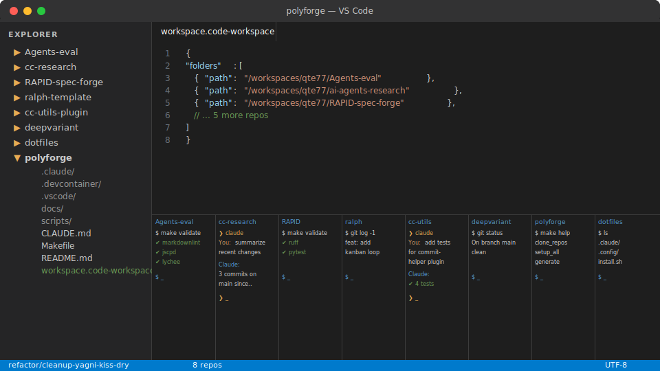

<!-- markdownlint-disable MD033 -->
# polyforge

Orchestrate AI coding agents across N repos
in parallel from one Codespace.

**For** teams running AI coding agents across a
polyrepo codebase in Codespaces or devcontainers.
**Run** `./scripts/cc-parallel.sh --preset validate`
to validate all repos in one command.

<picture>
  <source media="(prefers-color-scheme: dark)"
    srcset="assets/images/polyforge-dark.svg">
  <source media="(prefers-color-scheme: light)"
    srcset="assets/images/polyforge-light.svg">
  
</picture>


## Quick Start

```bash
./scripts/cc-parallel.sh --preset validate
./scripts/cc-parallel.sh --preset security
./scripts/cc-status.sh
```

## Configuration

Edit `workspace.code-workspace` to add/remove repos.
All scripts read from this single file.

Credentials: Codespaces encrypted secrets via
`containerEnv` in `devcontainer.json`.
Alternative: copy `.env.example` to `.env`.

## Docs

- `docs/cc-web-cloud-workflows.md` — Cloud execution
- `docs/cross-repo-setup.md` — CC multi-repo settings
- `docs/sandbox-friction.md` — Sandbox mitigations
